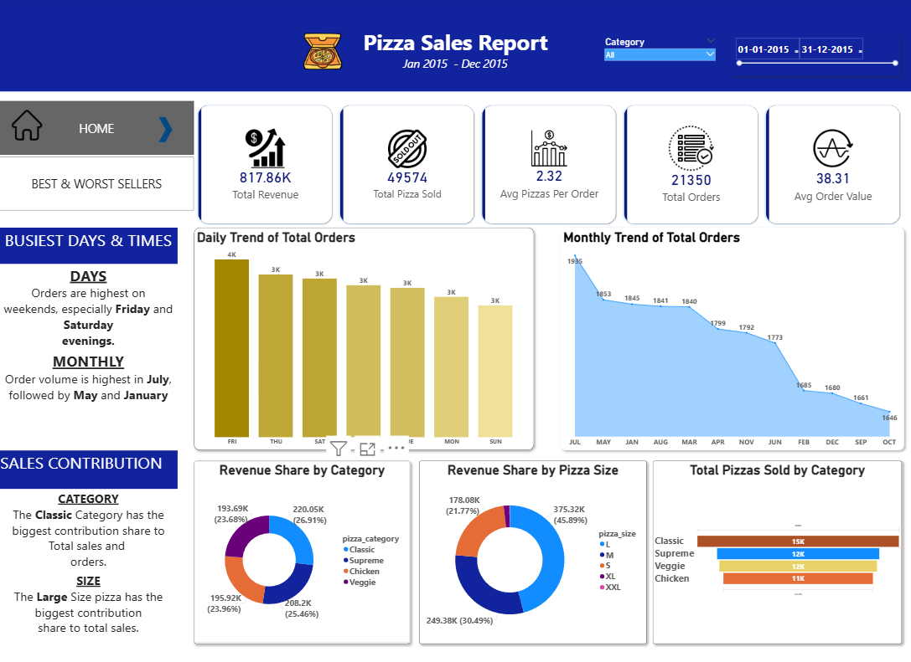
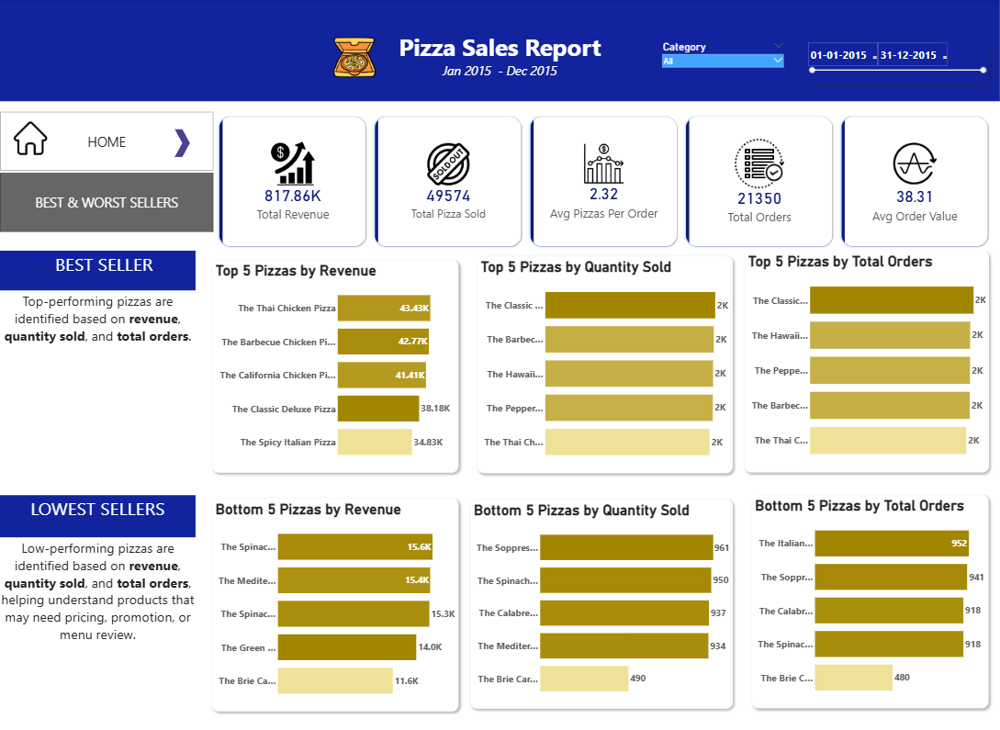

# Pizza Sales Analysis Dashboard

## Project Overview

This project is an interactive Power BI dashboard created to analyze pizza sales performance using historical sales data from January 2015 to December 2015.

The dashboard helps understand overall sales performance, order trends, revenue contribution by pizza category and size, and the best and lowest performing pizzas based on revenue, quantity sold, and total orders.

This project focuses on business intelligence, data visualization, data cleaning, data modeling, and dashboard design using Power BI.

---

## Dashboard Preview

### Home Page

The Home page provides an overview of key business metrics and sales trends.



### Best & Worst Sellers Page

This page analyzes the top-performing and lowest-performing pizzas based on revenue, quantity sold, and total orders.



---

## Project Objective

The main objective of this project is to create a Power BI dashboard that helps answer important business questions such as:

- What is the total revenue generated?
- How many pizzas were sold?
- What is the average order value?
- Which days have the highest number of orders?
- Which months have the highest order volume?
- Which pizza category contributes the most to revenue?
- Which pizza size contributes the most to revenue?
- Which pizzas are the best sellers?
- Which pizzas are the lowest sellers?

---

## Dashboard Pages

### 1. Home Page

The Home page provides a high-level overview of overall pizza sales performance.

Key metrics and visuals included:

- Total Revenue
- Total Pizzas Sold
- Average Pizzas Per Order
- Total Orders
- Average Order Value
- Daily Trend of Total Orders
- Monthly Trend of Total Orders
- Revenue Share by Pizza Category
- Revenue Share by Pizza Size
- Total Pizzas Sold by Category

### 2. Best & Worst Sellers Page

This page identifies the top-performing and lowest-performing pizzas based on revenue, quantity sold, and total orders.

Key visuals included:

- Top 5 Pizzas by Revenue
- Top 5 Pizzas by Quantity Sold
- Top 5 Pizzas by Total Orders
- Bottom 5 Pizzas by Revenue
- Bottom 5 Pizzas by Quantity Sold
- Bottom 5 Pizzas by Total Orders

---

## Dataset

The dataset contains pizza sales transaction records, including order details, pizza details, quantity, price, category, size, and total sales amount.

### Dataset Columns

- `pizza_id`
- `order_id`
- `pizza_name_id`
- `quantity`
- `order_date`
- `order_time`
- `unit_price`
- `total_price`
- `pizza_size`
- `pizza_category`
- `pizza_ingredients`
- `pizza_name`
- `Day`
- `Month`

Dataset file included:

```text
data/pizza_sales.xlsx
```
---

## Key Business Insights

- Total revenue generated was **817.86K**.
- Total pizzas sold were **49,574**.
- Total orders were **21,350**.
- Average pizzas per order was **2.32**.
- Average order value was **38.31**.
- Orders were highest on weekends, especially **Friday and Saturday evenings**.
- Order volume was highest in **July**, followed by **May and January**.
- The **Classic** pizza category contributed the highest share of total sales.
- The **Large** pizza size contributed the highest share of total sales.
- Best and lowest selling pizzas were identified using revenue, quantity sold, and total orders.

---

## Tools and Technologies Used

- Power BI
- Power Query
- DAX
- Data Cleaning
- Data Modeling
- Data Visualization
- Dashboard Design

---

## Files Included

```text
Pizza-Sales-Analysis-Dashboard/
│
├── Pizza-Sales-Analysis-Dashboard.pbix
├── README.md
├── data/
│   └── pizza_sales.xlsx
└── images/
    ├── home-page.png
    └── best-worst-sellers.png
```
---
## Conclusion

This dashboard provides a clear overview of pizza sales performance and helps identify important business insights such as revenue trends, order patterns, category contribution, size contribution, and product-level performance.

The insights from this dashboard can support business decisions related to sales strategy, product performance, customer demand patterns, and menu optimization.
---
---
## Author

Created by **Pranav P A**
